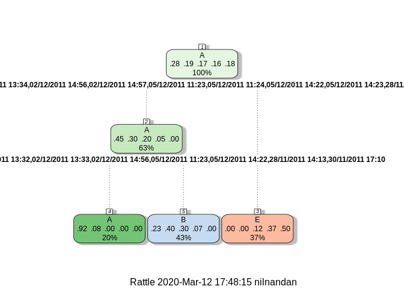
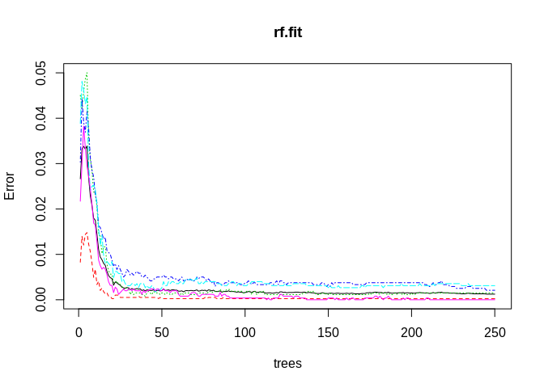

# Practical Machine Learning Project

## Background

Using devices such as Jawbone Up, Nike FuelBand, and Fitbit it is now possible to collect a large amount of data about personal activity relatively inexpensively. These type of devices are part of the quantified self movement ??? a group of enthusiasts who take measurements about themselves regularly to improve their health, to find patterns in their behavior, or because they are tech geeks. One thing that people regularly do is quantify how much of a particular activity they do, but they rarely quantify how well they do it. In this project, your goal will be to use data from accelerometers on the belt, forearm, arm, and dumbell of 6 participants. They were asked to perform barbell lifts correctly and incorrectly in 5 different ways. More information is available from the website here: http://groupware.les.inf.puc-rio.br/har (see the section on the Weight Lifting Exercise Dataset).

## Data

The training data for this project are available here:

https://d396qusza40orc.cloudfront.net/predmachlearn/pml-training.csv

The test data are available here:

https://d396qusza40orc.cloudfront.net/predmachlearn/pml-testing.csv

# Analysis

Loading data:


```r
training = read.csv("./pml-training.csv",na.strings=c("NA","#DIV/0!",""))
testing = read.csv("./pml-testing.csv",na.strings=c("NA","#DIV/0!",""))
# Data dimensions
dim(training)
```

```
## [1] 19622   160
```

```r
dim(testing)
```

```
## [1]  20 160
```


```r
# First look at the data
head(training)
head(testing)
```

Cross-validation will be performed by spliting the training dataset into:

1) A training dataset, containing 70% of the observations. The models for prediction will be built using this dataset.

2) A testing dataset, containing 30% of the observations. The accuracy of our prediction models will be evaluated using this dataset.


```r
# load packages
library(caret)
library(randomForest)
# Index for training dataset (70%) and testing dataset (30%) 
# from the pml-training data set
set.seed(12345)
inTrain = createDataPartition(y=training$classe,p=0.7, list=FALSE)
# training dataset
training.set = training[inTrain,]
# testing dataset
testing.set = training[-inTrain,]
```

Training and testing data consist of 160 variables. The choice of specific predictors is based on removing near zero variance predictors, with the nearZeroVar function, and also variables containing many NAs.


```r
# Remove near zero variance predictors
ind.nzv = nearZeroVar(x = training, saveMetrics = T)
# Remove variables with more than 50% NA values
ind.NA = !as.logical(apply(training, 2, function(x){ mean(is.na(x)) >= 0.5}))
# Cleaning data
ind2 = ind.NA*1 + (!ind.nzv$nzv)*1
ind3 = ind2 == 2
sum(ind3)
```

```
## [1] 59
```

```r
#View(data.frame(ind.NA, !ind.nzv$nzv, ind2, ind3))
training.set = training.set[,ind3]
testing.set = testing.set[, ind3]
training.set = training.set[, -1]
testing.set = testing.set[, -1]
testing = testing[,ind3]
testing = testing[,-1]
# Coerce the data into the same type in order to avoid
# "Matching Error" when calling random forest model, due to different levels in variables
for (i in 1:length(testing) ) {
  for(j in 1:length(training.set)) {
    if( length( grep(names(training.set[i]), names(testing)[j]) ) == 1)  {
      class(testing[j]) <- class(training.set[i])
    }      
  }      
}
# To get the same class between testing and training.set
testing = testing[,-ncol(testing)]
testing <- rbind(training.set[2, -58] , testing)
testing <- testing[-1,]
```

We will use two approaches to create a prediction model for the values of classe variable. 

Firstly prediction with trees will be attempted, using the 'rpart' method and the caret package.


```r
# Prediction with Trees
# Build model
set.seed(12345)
tree.fit = train(y = training.set$classe,
                 x = training.set[,-ncol(training.set)],
                 method = "rpart")
# Plot classification tree
rattle::fancyRpartPlot(
  tree.fit$finalModel
)
```

<!-- -->

```r
# Predictions with rpart model
pred.tree = predict(tree.fit, testing.set[,-ncol(testing.set)])
# Get results (Accuracy, etc.)
confusionMatrix(pred.tree, testing.set$classe)
```

```
## Confusion Matrix and Statistics
## 
##           Reference
## Prediction    A    B    C    D    E
##          A 1042  108    0    0    0
##          B  632 1023  763  167    0
##          C    0    0    0    0    0
##          D    0    0    0    0    0
##          E    0    8  263  797 1082
## 
## Overall Statistics
##                                           
##                Accuracy : 0.5347          
##                  95% CI : (0.5219, 0.5476)
##     No Information Rate : 0.2845          
##     P-Value [Acc > NIR] : < 2.2e-16       
##                                           
##                   Kappa : 0.4127          
##                                           
##  Mcnemar's Test P-Value : NA              
## 
## Statistics by Class:
## 
##                      Class: A Class: B Class: C Class: D Class: E
## Sensitivity            0.6225   0.8982   0.0000   0.0000   1.0000
## Specificity            0.9744   0.6709   1.0000   1.0000   0.7776
## Pos Pred Value         0.9061   0.3957      NaN      NaN   0.5033
## Neg Pred Value         0.8665   0.9648   0.8257   0.8362   1.0000
## Prevalence             0.2845   0.1935   0.1743   0.1638   0.1839
## Detection Rate         0.1771   0.1738   0.0000   0.0000   0.1839
## Detection Prevalence   0.1954   0.4393   0.0000   0.0000   0.3653
## Balanced Accuracy      0.7984   0.7845   0.5000   0.5000   0.8888
```

Secondly a prediction model using random forest method will be created.


```r
# Prediction with Random Forest
# Build model
set.seed(12345)
rf.fit = randomForest(
  classe ~ .,
  data = training.set,
  ntree = 250)
# Plot the Random Forests model
plot(rf.fit)
```

<!-- -->

```r
# Predict with random forest model
pred2 = predict(
  rf.fit,
  testing.set[,-ncol(testing.set)]
)
# Get results (Accuracy, etc.)
confusionMatrix(pred2, testing.set$classe)
```

```
## Confusion Matrix and Statistics
## 
##           Reference
## Prediction    A    B    C    D    E
##          A 1674    0    0    0    0
##          B    0 1139    1    0    0
##          C    0    0 1019    5    0
##          D    0    0    6  959    0
##          E    0    0    0    0 1082
## 
## Overall Statistics
##                                           
##                Accuracy : 0.998           
##                  95% CI : (0.9964, 0.9989)
##     No Information Rate : 0.2845          
##     P-Value [Acc > NIR] : < 2.2e-16       
##                                           
##                   Kappa : 0.9974          
##                                           
##  Mcnemar's Test P-Value : NA              
## 
## Statistics by Class:
## 
##                      Class: A Class: B Class: C Class: D Class: E
## Sensitivity            1.0000   1.0000   0.9932   0.9948   1.0000
## Specificity            1.0000   0.9998   0.9990   0.9988   1.0000
## Pos Pred Value         1.0000   0.9991   0.9951   0.9938   1.0000
## Neg Pred Value         1.0000   1.0000   0.9986   0.9990   1.0000
## Prevalence             0.2845   0.1935   0.1743   0.1638   0.1839
## Detection Rate         0.2845   0.1935   0.1732   0.1630   0.1839
## Detection Prevalence   0.2845   0.1937   0.1740   0.1640   0.1839
## Balanced Accuracy      1.0000   0.9999   0.9961   0.9968   1.0000
```

The accuracy of the random forest model is, as expected, much higher than the rpart model, over 0.99!

Random Forest model performed better and constitutes the model of choice for predicting the 20 observations of the original pml-testing.csv dataset.


```r
# Get predictions for the 20 observations of the original pml-testing.csv
pred.validation = predict(rf.fit, testing)
pred.validation
```

```
##  1 21  3  4  5  6  7  8  9 10 11 12 13 14 15 16 17 18 19 20 
##  B  A  B  A  A  E  D  B  A  A  B  C  B  A  E  E  A  B  B  B 
## Levels: A B C D E
```


```r
# Saving predictions for testing dataset
testing$pred.classe = pred.validation
write.table(
  testing,
  file = "testing_with_predictions",
  quote = F
)
```
